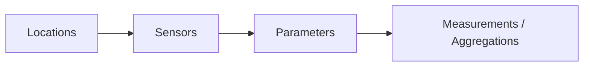
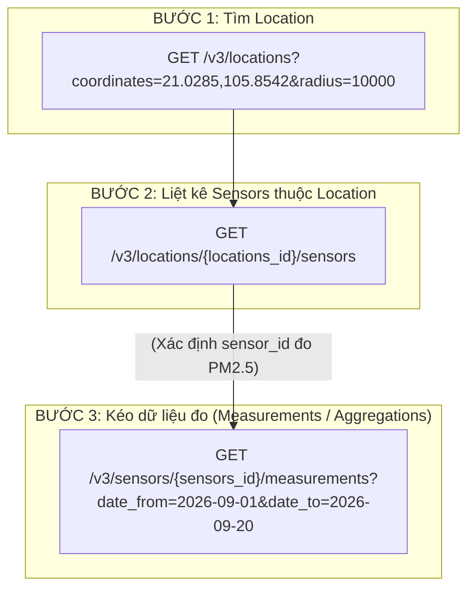

# 6.WAQI/OpenAQ v3
## 1.Tổng quan về OpenAQ v3 và WAQI
### 1.1.OpenAQ v3 
* OpenAQ là nền tảng mở quy mô toàn cầu chuyên tổng hợp dữ liệu chất lượng không khí theo thời gian thực và lịch sử từ các trạm quan trắc của chính phủ, viện nghiên cứu và mạng lưới cảm biến cộng đồng.
* OpenAQ API v3 cung cấp:
 ** Chuẩn hóa thực thể: Tách biệt rõ ràng giữa trạm đo ('locations'), cảm biến vật lý ('sensors'), thông số đo,bản ghi đo đạc
 ** Hỗ trợ dữ liệu lịch sử dài hạn (truy vấn theo ngày/tháng/năm)
 ** Quản lý phân quyền truy cập thông qua header 'X-API-Key'
#### 1.1.1.Mô hình dữ liệu quan hệ:

* Locations (Trạm quan trắc): Đại diện cho vị trí địa lý cố định hoặc di động (tọa độ coordinates, quốc gia country, độ cao, loại trạm đo của chính phủ hay cảm biến giá rẻ - low-cost sensor). Một Location có thể chứa nhiều Sensor.
* Sensors (Cảm biến vật lý): Thiết bị đo cụ thể gắn tại một location. Mỗi sensor thường chỉ đo đúng 1 tham số (parameter).
* Parameters (Thông số đo): Danh mục các chất ô nhiễm hoặc chỉ số khí tượng chuẩn hóa toàn cầu:Bụi & Khí: PM2.5, PM10 , O3 , NO2 , SO2 , CO. Thời tiết: Nhiệt độ, độ ẩm, áp suất, tốc độ gió.   Mỗi parameter có id, name, units (đã được quy chuẩn đồng nhất)
* Measurements & Aggregations (Chuỗi đo đạc): Dữ liệu chuỗi thời gian thực tế gắn liền với từng sensors_id.
#### 1.1.2.Luồng truy vấn dữ liệu chuẩn

#### 1.1.3. Các điểm cốt lõi của OpenAQ v3
* Địa điểm & Cảm biến:
  ** GET /v3/locations: Tìm kiếm trạm đo theo quốc gia, tọa độ bán kính (coordinates, radius), nhà cung cấp (providers_id).
  ** GET /v3/locations/{id}/latest: Lấy giá trị đo mới nhất của tất cả cảm biến tại trạm đó.
  ** GET /v3/locations/{id}/sensors: Xem toàn bộ danh sách cảm biến gắn tại trạm.
* Dữ liệu đo đạc & Thống kê tính toán sẵn:
  ** GET /v3/sensors/{sensors_id}/measurements: Lấy dữ liệu thô nguyên bản do trạm gửi về.
  ** GET /v3/sensors/{sensors_id}/hours: Dữ liệu trung bình theo giờ.
  ** GET /v3/sensors/{sensors_id}/days: Dữ liệu trung bình theo ngày.
  ** GET /v3/sensors/{sensors_id}/hours/dayofweek: Thống kê phân tích xu hướng ô nhiễm theo các ngày trong tuần (T2 - CN).
  ** GET /v3/sensors/{sensors_id}/hours/hourofday: Phân tích biến thiên ô nhiễm theo các khung giờ trong ngày (0h - 23h).
### 1.2.WAQI/AQICN
WAQI/AQICN là dự án dữ liệu môi trường xã hội cung cấp chỉ số chất lượng không khí theo thời gian thực cho hơn 30.000 trạm trên toàn cầu.
* Điểm mạnh của WAQI: Đã chuẩn hóa sẵn giá trị tính toán chỉ số AQI tổng thể và AQI cho từng chất ô nhiễm riêng biệt theo trạm.
* Dữ liệu trả về qua REST API dưới dạng JSON nhanh chóng, hỗ trợ tìm kiếm trạm qua tọa độ địa lý, thành phố hoặc mã định danh `feed`.
#### 1.2.1. Cơ chế tính toán AQI của WAQI
* Quy chuẩn tính toán: WAQI áp dụng tiêu chuẩn chuẩn hóa US-EPA (United States Environmental Protection Agency) để chuyển đổi nồng độ các chất gây ô nhiễm (như $\mu g/m^3$, $ppm$) sang thang điểm không thứ nguyên (từ 0 đến 500+).
